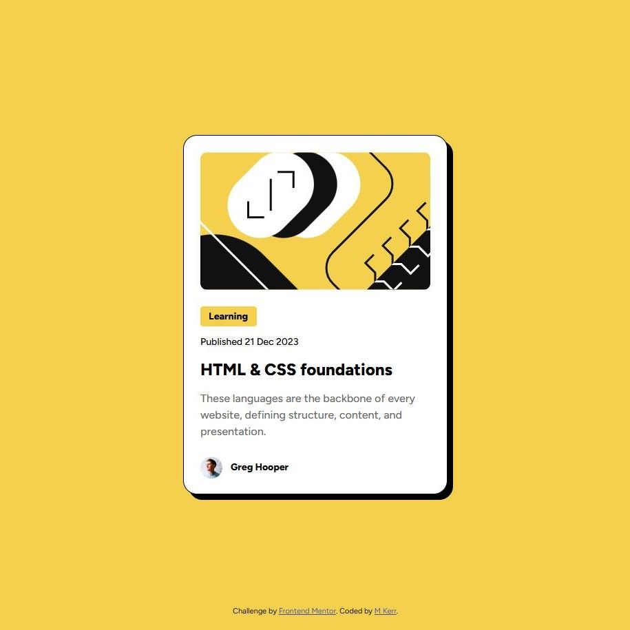

# Frontend Mentor - Blog preview card solution

This is a solution to the [Blog preview card challenge on Frontend Mentor](https://www.frontendmentor.io/challenges/blog-preview-card-ckPaj01IcS). Frontend Mentor challenges help you improve your coding skills by building realistic projects. 

## Table of contents

- [Overview](#overview)
  - [The challenge](#the-challenge)
  - [Screenshot](#screenshot)
  - [Links](#links)
- [My process](#my-process)
  - [Built with](#built-with)
  - [What I learned](#what-i-learned)

- [Author](#author)

## Overview

### The challenge

Users should be able to:

- See hover and focus states for all interactive elements on the page

### Screenshot

### Links

- Solution URL: [My Solution](https://www.frontendmentor.io/solutions/responsive-blog-preview-card-using-media-query-gOwiA5OCy2)
- Live Site URL: [Live site](https://mkerr-github.github.io/blog-preview-card/)

## My process

### Built with

- Semantic HTML5 markup
- CSS custom properties
- Flexbox

### What I learned

This was great practice for using rem units and a media query to ensure the card was sized for mobile and desktop.

## Author

- My GitHub - [M Kerr](https://github.com/mkerr-github)
- Frontend Mentor - [@mkerr-github](https://www.frontendmentor.io/profile/mkerr-github)

